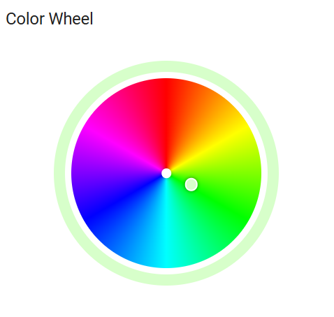

# Color Wheel Card for Home Assistant

A custom card for Home Assistant that provides an interactive color wheel for controlling color entities.



## Features

- Interactive color wheel with intuitive controls
- Accurate HSV color mapping with proper angle calculations
- Customizable wheel size, padding, and outer ring thickness
- Support for multiple color formats (hex, RGB, array)
- Real-time color updates with dragging support
- Responsive design that works on both desktop and mobile

## Installation

### HACS (Recommended)

1. Make sure [HACS](https://hacs.xyz/) is installed in your Home Assistant instance
2. Add this repository as a custom repository in HACS:
   - Go to HACS → Integrations → ⋮ → Custom repositories
   - Add `https://github.com/yourusername/colorwheel` with category "Plugin"
3. Install the "Color Wheel Card" from HACS
4. Restart Home Assistant

### Manual Installation

1. Download the `colorwheel-card.js` file from the latest release
2. Copy it to your `config/www` directory
3. Add the following to your `configuration.yaml` file:
   ```yaml
   lovelace:
     resources:
       - url: /local/colorwheel-card.js
         type: module
   ```
4. Restart Home Assistant

## Usage

Add the card to your Lovelace UI:

```yaml
type: custom:color-wheel-card
entity: input_text.color
title: Color Wheel
wheelSize: 300
padding: 5
outerThickness: 15
format: auto
```

### Configuration Options

| Option | Type | Default | Description |
|--------|------|---------|-------------|
| `entity` | string | Required | Entity ID to control |
| `title` | string | 'Color Wheel' | Card title |
| `wheelSize` | number | 300 | Diameter of the color wheel in pixels |
| `padding` | number | 5 | White padding around the wheel in pixels |
| `outerThickness` | number | 15 | Thickness of the outer ring in pixels |
| `format` | string | 'auto' | Color format to use ('auto', 'hex', 'rgb', 'array') |

## Development

```bash
# Clone the repository
git clone https://github.com/yourusername/colorwheel.git

# Navigate to the directory
cd colorwheel

# Install dependencies
npm install

# Build the project
npm run build
```

## License

MIT